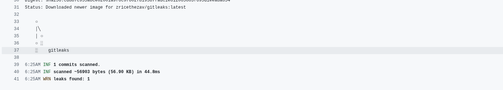
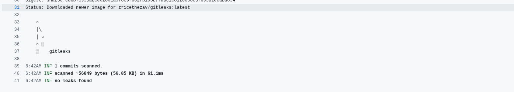

## Pipeline Steps

The CI/CD workflow includes the following steps:

- **Checkout Repository**
    - Uses `actions/checkout@v4` to pull the latest code.

- **Set Up JDK 17**
    - Ensures compatibility with the Spring Boot application.

- **Build Application**
    - Runs `./gradlew clean build` to compile and package the app.

- **Build Docker Image**
    - Creates a Docker image (`spring-app`) for scanning with OWASP ZAP.

- **Create Docker Network**
    - Isolates the application and OWASP ZAP scanner for network communication.

- **Start Spring Boot Container**
    - Launches the container and waits for `/actuator/health` to confirm readiness.

- **Run OWASP ZAP Baseline Scan (DAST)**
    - Performs dynamic security testing on the running app.
    - Generates reports:
        - `report_html.html` → human-readable
        - `report_json.json` → machine-readable
        - `report_md.md` → Markdown summary
    - Reports are saved in `zap-workspace/`.

- **Run Semgrep Scan (SAST & Secrets Detection)**
    - Performs static analysis to detect:
        - Code-level vulnerabilities
        - Insecure patterns
        - Hardcoded secrets
    - Reports generated in JSON and SARIF format.
    - Saved in `semgrep-workspace/`.

- **Run Gitleaks Scan (Secrets Detection)**
    - Scans the repository for **hardcoded secrets**.
    - JSON report saved in `gitleaks-workspace/`.

- **Upload Reports as Artifacts**
    - All scan reports (`zap-workspace/`, `semgrep-workspace/`, `gitleaks-workspace/`) are uploaded to GitHub Actions artifacts.
    - Artifacts are retained for 30 days.

- **Display Scan Summary**
    - Adds a step summary in GitHub Actions for quick review.
  

## Two Vulnerabilities found and their recommended fix

1. **A03:2021 – Injection (SQL Injection)**
- Impact
    - Attackers can have access to sensitive information
    - Data can easily be deleted or modified
    - Authentication can be bypassed and any user can be returned.

```
Connection conn = DriverManager.getConnection("jdbc:h2:mem:testdb", "sa", ""); 
Statement stmt = conn.createStatement(); 
ResultSet rs = stmt.executeQuery(
"SELECT * FROM users WHERE username = '" + username + "'"); 
```

> **An attacker can send username = ' OR '1'='1 (or other payloads) and change the query semantics, e.g. returning every user or worse.**

- Fix
    -  Using JPA removes most raw SQL concatenation risks if you use parameter binding or repository methods:

````
 public interface UserRepository extends JpaRepository<UserEntity, Long> {
       Optional<UserEntity> findByUsername(String username);
 }
````
> **Then call userRepository.findByUsername(username). The framework handles parameter binding.**

2. **A07:2021 – Identification & Authentication Failures**
- Impact
    - Attacker can easily hack your account if passwords are hardcoded
    - They can access sensitive endpoints

```
    private static final String USERNAME = "admin";
    private static final String PASSWORD = "password";
```
> **An attacker can have access to a sensitive endpoint using this password **

- Fix
    - Remove hardcoded credentials — never store secrets in source code. Use environment variables or a secrets manager (Vault, AWS Secrets Manager, GitHub/GitLab secrets).

## Evidence of Fixing one vulnerability
Found a leaked secret using gitleaks


Removed the secret, here is the screenshot


here you can clearly see no leaks are being found

## Core Concept Questions

### What is the difference between SAST, DAST, and secrets scanning, and why should all be part of a CI/CD pipeline?

**SAST - Static Application Security Testing**
- Analyzes your source code, bytecode, or binaries without running the application.
- Looks for vulnerabilities like:
  - SQL Injection, XSS
  - Hardcoded credentials
  - Insecure cryptography
  - Unsafe deserialization
- Catches issues early in development (“shift-left”).

**DAST - Dynamic Application Security Testing**
- Tests the running application by sending HTTP requests and analyzing responses.
- Simulates an attacker hitting your app from the outside.
- Detects vulnerabilities like:
  - Missing security headers
  - Cross-Site Scripting (XSS)
  - SQL Injection in live endpoints
  - Authentication flaws
- Finds runtime/configuration issues that SAST can’t see.

**Secrets Scanning**
- Detects hardcoded secrets like:
  - API keys
  - Database passwords
  - Certificates and tokens
- Prevents credential leaks that could compromise entire environments.

### Why is storing secrets in code dangerous? What’s a secure alternative?

- Pushing secrets to GitHub, GitLab, or other version control systems can make them publicly visible.
- Even deleted secrets may remain in Git history, which attackers can retrieve.
- Changing a secret requires updating code everywhere it’s used, which is error-prone.
- Multiple developers or CI/CD agents may get access to the secret unnecessarily.
- Attackers can use leaked credentials to access databases, cloud resources, or third-party APIs.
- Leads to data breaches, financial loss, or service compromise.

**Secure Alternatives**
- environment variables,
- secret managers or vaults
- encrypted configuration files

### How does adding these scans to a pipeline help enforce Shift-Left Security?
- Detects issues early
  - Developers fix issues before they reach production, reducing cost and effort

- Automates Security Checks
  - Integrating scans into CI/CD ensures that every commit and pull request is automatically checked.
  - No reliance on manual code reviews alone, which can miss subtle vulnerabilities.

### If a scan fails in your pipeline, what is the next step for a developer or DevOps engineer?
- Review the Scan Report
  - Identify:
    - Severity (High, Medium, Low)
    - Type of issue (SQL injection, hardcoded secret, insecure configuration)
    - Location in code or endpoint

- Prioritize the Issue
  - Block the merge or deployment immediately.
  - Evaluate if fix is urgent or can be scheduled.
  - Document and optionally suppress if validated.

- Fix the Issue
  - Refactor code to remove unsafe patterns.
  - Remove hardcoded secrets and use environment variables or secret manager.
  - Fix insecure endpoints, headers, TLS settings.

- Re-run the pipeline to ensure the vulnerability is removed.