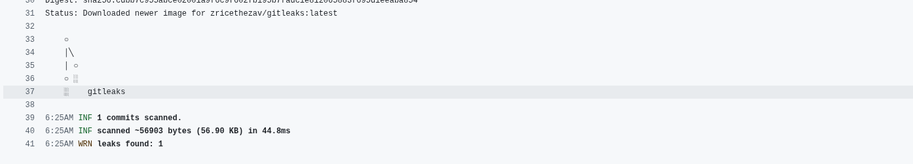
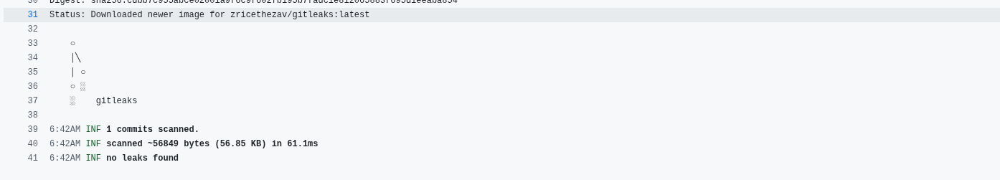

## Setup steps

### 1. Clone the repository
```bash
git clone https://github.com/jasleenwahi/pi-shaped-workshop-jasleen.git
```

### 2. Build and run the Spring Boot app locally
```bash
./gradlew clean build
./gradlew bootRun
```

## Scan results (with screenshots/artifacts)

Can be found [here](/Security_Compliance_workshop-Jasleen/day5/Screenshots)

## Two Vulnerabilities found and their recommended fix

1. **A03:2021 – Injection (SQL Injection)**
- Impact
    - Attackers can have access to sensitive information
    - Data can easily be deleted or modified
    - Authentication can be bypassed and any user can be returned.

```
Connection conn = DriverManager.getConnection("jdbc:h2:mem:testdb", "sa", ""); 
Statement stmt = conn.createStatement(); 
ResultSet rs = stmt.executeQuery(
"SELECT * FROM users WHERE username = '" + username + "'"); 
```

> **An attacker can send username = ' OR '1'='1 (or other payloads) and change the query semantics, e.g. returning every user or worse.**

- Fix
    -  Using JPA removes most raw SQL concatenation risks if you use parameter binding or repository methods:

````
 public interface UserRepository extends JpaRepository<UserEntity, Long> {
       Optional<UserEntity> findByUsername(String username);
 }
````
> **Then call userRepository.findByUsername(username). The framework handles parameter binding.**

2. **A07:2021 – Identification & Authentication Failures**
- Impact
    - Attacker can easily hack your account if passwords are hardcoded
    - They can access sensitive endpoints

```
    private static final String USERNAME = "admin";
    private static final String PASSWORD = "password";
```
> **An attacker can have access to a sensitive endpoint using this password **

- Fix
    - Remove hardcoded credentials — never store secrets in source code. Use environment variables or a secrets manager (Vault, AWS Secrets Manager, GitHub/GitLab secrets).

## Evidence of Fixing one vulnerability
Found a leaked secret using gitleaks


Removed the secret, here is the screenshot


here you can clearly see no leaks are being found

## Answers to Scenario based questions

### Q1: What happens if a new vulnerable dependency is added?
The Trivy FS scan will detect the vulnerable package and flag it in `trivy-deps-report.json`. The pipeline will continue running due to `continue-on-error: true`, but the report will highlight the issue for developers to fix.

### Q2: How can we prevent secrets from being committed?
Use tools like **Gitleaks** in the pipeline to detect secrets before they are merged. Additionally, implement pre-commit hooks and use secret management solutions like AWS Secrets Manager or HashiCorp Vault.

### Q3: How can we ensure infrastructure is secure before deployment?
Use **Checkov** to scan Terraform code for misconfigurations. Integrate it into the CI pipeline to block insecure infrastructure from being deployed.

## Core Concept Questions

### 1. How each tool contributes to security & compliance

| Tool | Layer | Contribution |
|------|-------|--------------|
| Gitleaks | Secrets | Detects hardcoded keys and credentials |
| Checkov / tfsec | IaC | Prevents misconfigurations before deployment |
| Dependency-Check / Snyk | Dependencies | Flags vulnerable libraries (CVE) |
| Trivy | Containers | Scans base images and packages for vulnerabilities |
| ZAP | Runtime | Simulates attacker behavior and finds live issues |

### 2. Pick one critical vulnerability: how could it be exploited, what’s the business impact, and how do you remediate it?

- **Exploit:** Attackers retrieve keys from Git or HTTP responses to access APIs or cloud resources.
- **Impact:** Data theft, unauthorized access, regulatory penalties.
- **Remediation:** Remove secrets, rotate keys, use secret managers.

### 3. How would you prioritize fixes when multiple issues are reported (consider severity, compliance impact, ease of remediation)?

| Criterion | Why It Matters |
|----------|------------------|
| Severity | High CVSS score = bigger risk |
| Exploitability | Internet-exposed > internal |
| Compliance Impact | Ties to frameworks (GDPR, CIS) |
| Business Impact | Cost, downtime, brand risk |
| Ease of Remediation | Quick wins first |

### 4. How do Checkov findings map to frameworks like CIS AWS / NIST / GDPR? Provide one real example.

Example: `CKV_AWS_17 – S3 bucket is public`
- CIS AWS 3.1 – Ensure S3 buckets are not public
- NIST SP 800-53 – AC-3 (Access enforcement)
- GDPR Article 32 – Secure processing of personal data

### 5. Why are both ZAP (runtime) and Trivy (image scan) needed? What unique gaps does each fill?

| Tool | Focus | Detects |
|------|--------|----------|
| ZAP | Runtime | XSS, missing headers, exposed secrets |
| Trivy | Build-time | Vulnerable packages, misconfigured images |

Trivy reduces the **attack surface pre-deployment**, while ZAP identifies **runtime vulnerabilities** post-deployment. Both are essential for end-to-end security.
